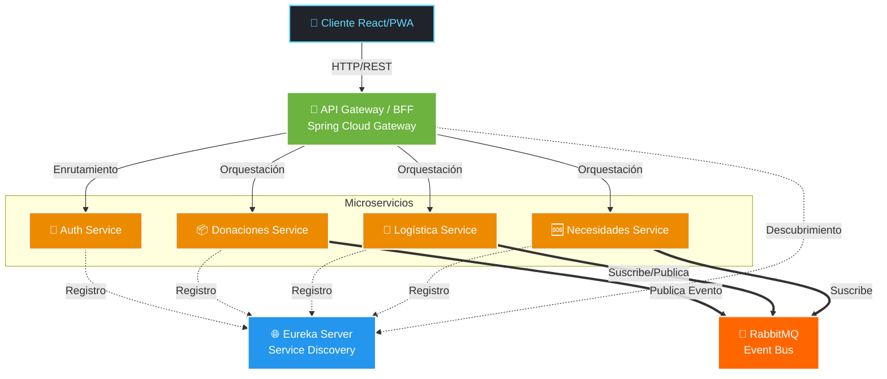

<div align="center">
  <h1>🌍 Sistema Donatón</h1>
  <p><strong>Plataforma Logística y de Ayuda Humanitaria de Nivel Empresarial</strong></p>
  <p>Una solución robusta, escalable y resiliente basada en microservicios, diseñada para orquestar y optimizar el ciclo de vida completo de donaciones en escenarios críticos de emergencia.</p>

  <!-- Badges -->
  <p>
    
    
    
    
    
    
    
    
    
    
    
    
    
  </p>
</div>

---

## 🏛 Arquitectura del Sistema

El **Sistema Donatón** implementa una arquitectura de **Microservicios** altamente desacoplada y escalable. Utilizamos un patrón de **API Gateway** acoplado a un **BFF (Backend for Frontend)** para centralizar el acceso, orquestar llamadas a servicios subyacentes y optimizar la experiencia de los clientes (web y móviles). La comunicación asíncrona se gestiona mediante un bus de eventos, garantizando alta disponibilidad y consistencia eventual a lo largo del flujo logístico.



---

## 🧩 Catálogo de Microservicios

El dominio de la aplicación ha sido cuidadosamente particionado utilizando principios de Domain-Driven Design (DDD).

| Servicio | Puerto Default | Responsabilidad Principal |
| :--- | :---: | :--- |
| **API Gateway / BFF** | `8080` | Punto de entrada único. Enrutamiento, agregación de datos y protección mediante Circuit Breaker. |
| **Eureka Server** | `8761` | Registro y descubrimiento dinámico de la malla de microservicios. |
| **Auth Service** | `8081` | Gestión de identidades, autenticación, autorización y emisión/validación de tokens JWT. |
| **Donaciones Service** | `8082` | Gestión del inventario de ayudas, clasificación y validación de stock disponible. |
| **Logística Service** | `8083` | Asignación y tracking de vehículos, rutas y trazabilidad de la operación en curso. |
| **Necesidades Service** | `8084` | Registro de emergencias, cálculo de requerimientos y ubicación geográfica. |

---

## 🚀 Características Core (Business Logic)

Nuestra plataforma está diseñada para resolver desafíos críticos de logística en el menor tiempo posible:

*   🔐 **Seguridad Stateless con JWT:** Autenticación robusta de extremo a extremo sin mantener estado en los servidores, permitiendo un escalamiento horizontal infinito.
*   📨 **Orquestación Asíncrona (RabbitMQ):** Desacoplamiento de procesos pesados mediante mensajería por eventos. Garantiza notificaciones inmediatas y consistencia transaccional distribuida entre servicios.
*   🛡️ **Resiliencia y Tolerancia a Fallos:** Implementación nativa del patrón **Circuit Breaker** (vía Resilience4j) en el BFF para aislar fallos, evitar caídas en cascada y asegurar respuestas rápidas incluso en degradación.
*   🧠 **Algoritmos Core de Asignación en Tiempo Real:** Lógica de negocio avanzada para la validación inteligente de stock de donaciones y asignación automatizada de vehículos de transporte basada en capacidad y urgencia.
*   🗺️ **Mapping y Geolocalización Interactivo:** Integración con *Leaflet* para presentar un mapa dinámico de emergencias. Facilita la toma de decisiones espaciales con un sólido *fallback* a vistas tabulares de datos para garantizar accesibilidad en caso de fallo del DOM o conectividad limitada.
*   📱 **Trazabilidad PWA (Offline Support):** Integración de características de Progressive Web App (Service Workers y Storage API) para asegurar la trazabilidad de la última milla, permitiendo operaciones en campo sin conexión a internet constante.

---

## 🧪 Prácticas Ágiles y Cultura de Calidad

El *Sistema Donatón* no es solo un producto funcional, sino un referente de excelencia técnica en ingeniería de software:

*   🔄 **Desarrollo Iterativo:** Construido utilizando marcos ágiles, enfocándonos en entregas de valor continuo y refactorización temprana.
*   🎯 **100% Code Coverage:** El backend cuenta con una cobertura absoluta de pruebas unitarias implementadas con **JUnit 5** y **Mockito**, garantizando la fiabilidad y mitigando regresiones en la lógica de negocio.
*   🛡️ **Zero Vulnerabilidades (SonarQube):** Análisis de código estático continuo integrado en el ciclo de vida. Hemos superado con éxito rigurosos Quality Gates, procesando meticulosamente todos los *Security Hotspots* para asegurar un software robusto y libre de fallos de seguridad reportados.

---

## 🛠️ Guía de Despliegue Local

Acelera tu entorno de desarrollo en minutos gracias a la contenedorización completa de la infraestructura.

### Requisitos Previos
*   Docker & Docker Compose
*   Node.js (v18+) & npm
*   Java 17 (opcional si se ejecuta puramente en Docker)

### Paso 1: Levantar la Infraestructura y Backend
En la raíz del proyecto, ejecuta el siguiente comando para desplegar las bases de datos (MySQL), el gestor de colas (RabbitMQ) y toda la malla de microservicios:

```bash
docker-compose up -d --build
```
> *Tip: Puedes verificar el estado y los logs de los contenedores con `docker ps` y `docker-compose logs -f`. El panel de Eureka estará disponible en `http://localhost:8761`.*

### Paso 2: Iniciar el Frontend
En una nueva terminal, navega al directorio de la aplicación frontend (ej. `cd frontend`) y levanta el servidor de desarrollo:

```bash
npm install
npm run dev
```

La plataforma estará lista y accesible desde tu navegador en `http://localhost:5173`.

---
<div align="center">
  <i>Construido con resiliencia y código limpio para quienes más lo necesitan. 🌍🤝</i>
</div>
