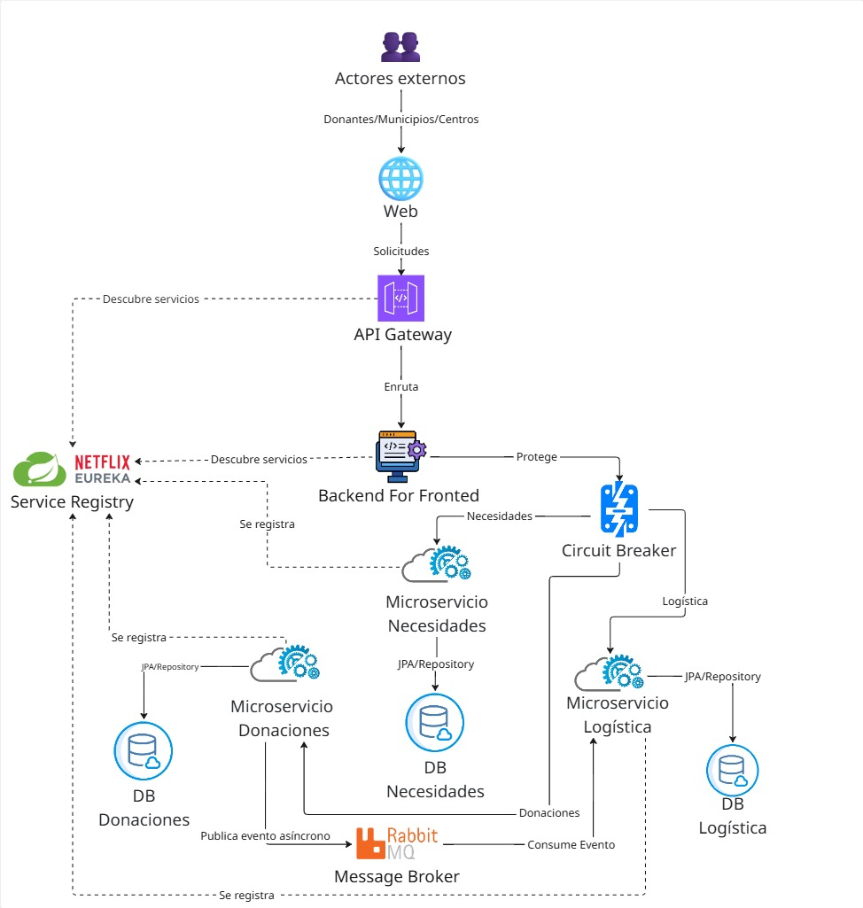

<div align="center">
  <h1>🌍 Sistema Donatón</h1>
  <p><strong>Plataforma Logística y de Ayuda Humanitaria de Nivel Empresarial</strong></p>
  <p>Una solución robusta, escalable y resiliente basada en microservicios, diseñada para orquestar y optimizar el ciclo de vida completo de donaciones en escenarios críticos de emergencia.</p>

  <!-- Badges -->
  <p>
    
    
    
    
    
    
    
    
    
    
    
    
    
    
  </p>
</div>

---

## 🏛 Arquitectura del Sistema

El **Sistema Donatón** implementa una arquitectura de **Microservicios** altamente desacoplada y escalable. Utilizamos un patrón de **API Gateway** acoplado a un **BFF (Backend for Frontend)** para centralizar el acceso, orquestar llamadas a servicios subyacentes y optimizar la experiencia de los clientes (web y móviles). La comunicación asíncrona se gestiona mediante un bus de eventos, garantizando alta disponibilidad y consistencia eventual a lo largo del flujo logístico.

<div align="center">
  
</div>

---

## 🧩 Catálogo de Microservicios

El dominio de la aplicación ha sido cuidadosamente particionado utilizando principios de Domain-Driven Design (DDD).

| Servicio | Puerto Default | Responsabilidad Principal |
| :--- | :---: | :--- |
| **API Gateway / BFF** | `8080` | Punto de entrada único. Enrutamiento, agregación de datos y protección mediante Circuit Breaker. |
| **Eureka Server** | `8761` | Registro y descubrimiento dinámico de la malla de microservicios. |
| **Auth Service** | `8081` | Gestión de identidades, autenticación, autorización y emisión/validación de tokens JWT. |
| **Donaciones Service** | `8082` | Gestión del inventario de ayudas, clasificación y validación de stock disponible. |
| **Logística Service** | `8083` | Asignación y tracking de vehículos, rutas y trazabilidad de la operación en curso. |
| **Necesidades Service** | `8084` | Registro de emergencias, cálculo de requerimientos y ubicación geográfica. |

---

## 🚀 Características Core

Nuestra plataforma está diseñada para resolver desafíos críticos de logística en el menor tiempo posible:

*   🔐 **Seguridad Stateless con JWT:** Autenticación robusta de extremo a extremo sin mantener estado en los servidores, permitiendo un escalamiento horizontal infinito.
*   📨 **Orquestación Asíncrona (RabbitMQ):** Desacoplamiento de procesos pesados mediante mensajería por eventos. Garantiza notificaciones inmediatas y consistencia transaccional distribuida entre servicios.
*   🛡️ **Resiliencia y Tolerancia a Fallos:** Implementación nativa del patrón **Circuit Breaker** (vía Resilience4j) en el BFF para aislar fallos, evitar caídas en cascada y asegurar respuestas rápidas incluso en degradación.
*   🧠 **Algoritmos Core de Asignación en Tiempo Real:** Lógica de negocio avanzada para la validación inteligente de stock de donaciones y asignación automatizada de vehículos de transporte basada en capacidad y urgencia.
*   📊 **Dashboards Administrativos Unificados:** Interfaces completas y estandarizadas (Acopio, Conductor y Administración Global) con sistemas de paginación consistentes, controles de formulario estrictos (separación natural/jurídica) y UX avanzada.
*   📦 **Logística de Inventario por Subcategoría:** Agrupación y emparejamiento milimétrico de recursos mediante "Subcategorías" (ej. Fideos vs simplemente Alimentos) para una mayor precisión en los centros de acopio.
*   🗺️ **Mapping y Geolocalización Interactivo:** Integración con *Leaflet* para presentar un mapa dinámico de emergencias. Facilita la toma de decisiones espaciales con un sólido *fallback* a vistas tabulares de datos para garantizar accesibilidad en caso de fallo del DOM o conectividad limitada.
*   📱 **Trazabilidad PWA (Offline Support):** Integración de características de Progressive Web App (Service Workers y Storage API) para asegurar la trazabilidad de la última milla, permitiendo operaciones en campo sin conexión a internet constante.

---

## 🧪 Prácticas Ágiles y Cultura de Calidad

El *Sistema Donatón* no es solo un producto funcional, sino un referente de excelencia técnica en ingeniería de software:

*   🔄 **Desarrollo Iterativo:** Construido utilizando marcos ágiles, enfocándonos en entregas de valor continuo y refactorización temprana.
*   🎯 **60% Code Coverage:** El backend cuenta con una cobertura del 60% en pruebas unitarias implementadas con **JUnit 5** y **Mockito**, garantizando la fiabilidad y mitigando regresiones en la lógica de negocio.
*   🛡️ **Zero Vulnerabilidades (SonarQube):** Análisis de código estático continuo integrado en el ciclo de vida. Hemos superado con éxito rigurosos Quality Gates, procesando meticulosamente todos los *Security Hotspots* para asegurar un software robusto y libre de fallos de seguridad reportados.

---

## 🛠️ Guía de Despliegue Local

Acelera tu entorno de desarrollo en minutos gracias a la contenedorización completa de la infraestructura.

### Requisitos Previos
*   Docker & Docker Compose
*   Node.js (v18+) & npm
*   Java 17 (opcional si se ejecuta puramente en Docker)

### Paso 1: Compilar y Levantar la Infraestructura y Backend
Dado que las imágenes de Docker requieren los ejecutables `.jar` ya construidos, primero debes compilar los microservicios. 

En la raíz del proyecto, ejecuta el siguiente comando en **PowerShell** para compilar todos los microservicios automáticamente (omitiendo los tests para mayor rapidez):

```powershell
Get-ChildItem -Directory -Filter "donaton-*" | Where-Object { Test-Path "$($_.FullName)\mvnw.cmd" } | ForEach-Object { Write-Host "Compilando $($_.Name)..." -ForegroundColor Green; cd $_.FullName; .\mvnw.cmd clean package -DskipTests; cd .. }
```

Una vez que todos los proyectos compilen con éxito (`BUILD SUCCESS`), ejecuta el siguiente script de PowerShell para levantar ordenadamente toda la malla de microservicios, bases de datos y herramientas adicionales en sus respectivos stacks:

```powershell
.\start-all.ps1
```
> *Tip: Puedes verificar el estado de los contenedores con `docker ps`. El panel de Eureka estará disponible en `http://localhost:8761`. Para detener de manera segura toda la arquitectura, ejecuta `.\stop-all.ps1`.*

### Paso 2: Inyección de Datos de Prueba (Opcional)
Para probar el sistema con miles de registros (usuarios, donaciones, centros de acopio y necesidades), hemos desarrollado un proceso automatizado que genera e inyecta la data en los contenedores.

Abre una terminal en la raíz del proyecto y ejecuta el siguiente script:
```powershell
.\inject-seed.ps1
```

> **Nota:** Este script borrará los datos actuales de la base de datos (limpiándola), reiniciará los microservicios para regenerar las tablas, generará los datos mediante scripts de Python y los inyectará de forma segura. La contraseña para todos los usuarios de prueba será `admin123`.

### Paso 3: Iniciar el Frontend
En una nueva terminal, navega al directorio de la aplicación frontend (ej. `cd donaton-frontend`) y levanta el servidor de desarrollo:

```bash
npm install
npm run dev
```

La plataforma estará lista y accesible desde tu navegador en `http://localhost:5173`.

### Paso 4: Ejecución de Pruebas y Análisis en SonarQube (Backend)

Para ejecutar las pruebas unitarias y enviar el reporte de cobertura de todo el backend a SonarQube (que corre localmente en `http://localhost:9000`), hemos creado un script automatizado que itera por todos los microservicios.

Asegúrate de que el contenedor de SonarQube esté en ejecución, genera tu token desde el panel local, y luego ejecuta el siguiente script en la raíz del proyecto:

```powershell
.\run-sonar-all.ps1 -SonarToken "tu_token_generado_aqui"
```
*(Este proceso compilará, testeará y enviará el código fuente de los 6 microservicios directamente a SonarQube).*

**Alternativa Local (Sin SonarQube):**
Si solo deseas correr las pruebas y generar un reporte visual de cobertura en HTML (JaCoCo) de manera offline, puedes ejecutar:
```powershell
.\run-tests-local.ps1
```
*(Los reportes se generarán en la ruta `target/site/jacoco/index.html` de cada microservicio).*

### Paso 5: Pruebas Unitarias del Frontend

El cliente web utiliza **Vitest** y **React Testing Library** para asegurar la calidad de la interfaz. Dentro de la carpeta `donaton-frontend`, puedes ejecutar:

- `npm run test`: Para correr las pruebas en modo rápido y verificar el estado.
- `npm run coverage`: Para ejecutar todas las pruebas y generar un reporte de cobertura en consola (asegurando el >60% estipulado).

### Paso 6: Pruebas de Integración (Smoke Tests)

Para verificar que toda la arquitectura backend está levantada y comunicándose correctamente (API Gateway + Microservicios), puedes ejecutar el script de Smoke Tests de PowerShell en la raíz del proyecto:

```powershell
.\test-endpoints.ps1
```
*(Este script realizará llamadas HTTP reales a los flujos principales de la aplicación: Registro, Login, Creación de Donaciones, Necesidades y Despachos, confirmando que las integraciones y reglas de negocio estén funcionando).*

---
<div align="center">
  <i>Construido con resiliencia y código limpio para quienes más lo necesitan. 🌍🤝</i>
</div>
